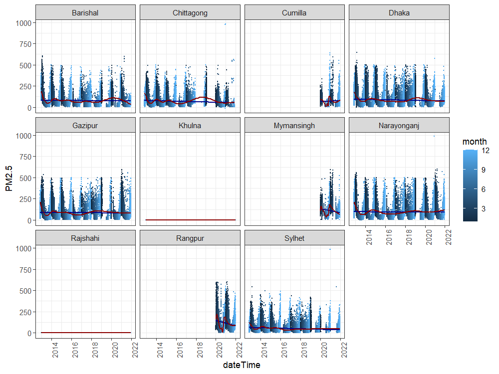

# Analysis of Air Data

We see that the rise of PM2.5 levels are around sharp cuts of the colors, indicating month, signaling that it's a seasonality, increased PM2.5 levels during winter, every year.

However during 2017-19 we see an increase of PM2.5 count even during the middle of the years. This was reflected in Jaynal vai's data, marked in yellow, aroudn that time as well.

A lack of data after 2019 for around 6 months indicate that the data collection process was on hold during the start of the COVID-19 Pandemic.

By

- Yusuf Sharkar
- Sanjida Apu
- Azfar Mahmud Alif
- Ahmed Ar-Rafi
- Khalid Muntasir